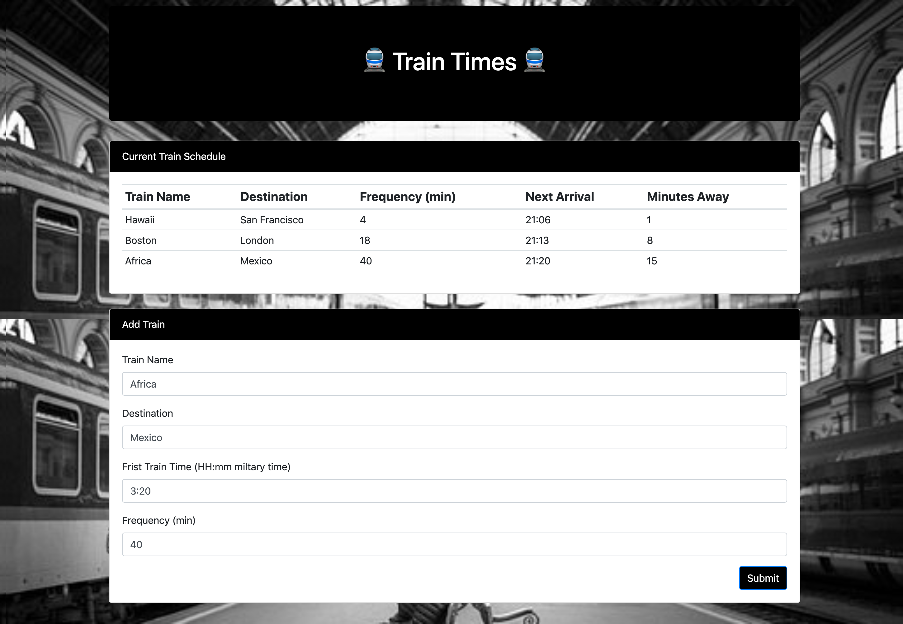

# Train-Scheduler

### I created a train application where the user can input their train name, destination, time and frequency. The info is then stored on firebase's realtime database, displayed on the html from the database, and then calculates the time of the next train and minutes away with moment.js.

## Tech I Used

1. [JavaScript](https://www.w3schools.com/js/js_intro.asp)
2. [BootStrap](https://getbootstrap.com/docs/4.3/getting-started/introduction/) 
3. [HTML](https://www.w3schools.com/html/html_intro.asp)
4. [CSS](https://www.w3schools.com/html/html_css.asp)
5. [JQuery](https://www.w3schools.com/jquery/default.asp)
6. [Firebase](https://hackernoon.com/introduction-to-firebase-218a23186cd7)

Author : [Matthew Kuh](https://github.com/matkuh)